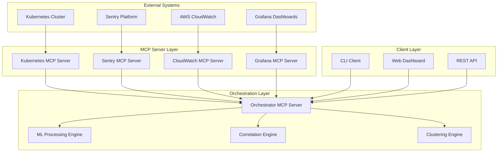
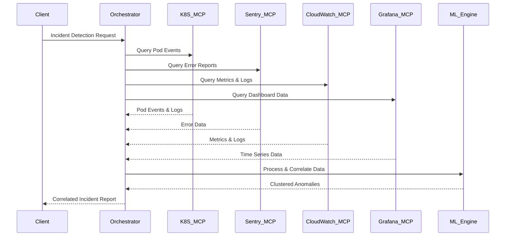
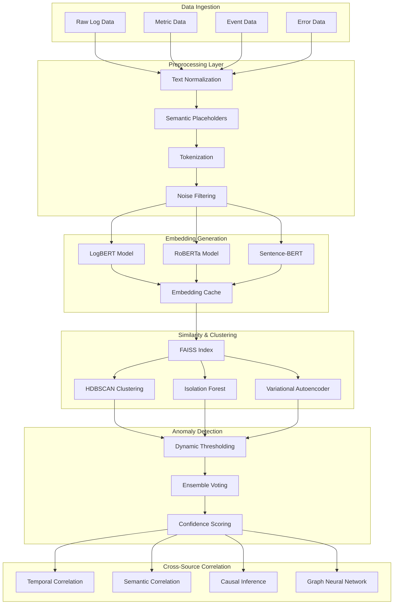

# Design Document

## Overview

The MCP Infrastructure Orchestrator is a distributed system that leverages the Model Context Protocol (MCP) to create a unified incident detection and response platform. The architecture consists of five specialized MCP servers working in concert: four data source servers (Kubernetes, Sentry, CloudWatch, Grafana) and one orchestrator server that performs intelligent correlation and analysis.

The system employs a hub-and-spoke architecture where the orchestrator acts as the central intelligence hub, coordinating data retrieval from source servers and applying advanced machine learning techniques for zero-shot anomaly clustering and cross-source incident correlation.

## Architecture

### High-Level Architecture



### MCP Protocol Implementation

Each MCP server implements the standard MCP protocol with the following core capabilities:

- **Resource Discovery**: Enumerate available data sources and capabilities
- **Tool Execution**: Execute queries and data retrieval operations
- **Streaming Support**: Handle real-time data streams for live monitoring
- **Error Handling**: Standardized error responses with retry mechanisms
- **Authentication**: Secure access control with API key and OAuth support

### Data Flow Architecture



## Components and Interfaces

### 1. Kubernetes MCP Server

**Purpose**: Provides unified access to Kubernetes cluster telemetry data

**Key Interfaces**:
- `get_pods(namespace?, labels?, status?)`: Retrieve pod information with filtering
- `get_events(namespace?, since?, type?)`: Fetch cluster events with time filtering
- `get_logs(pod_name, container?, since?, lines?)`: Stream or retrieve pod logs
- `get_metrics(resource_type, name?, namespace?)`: Retrieve resource utilization metrics
- `get_node_status()`: Get cluster node health and capacity information

**Data Models**:
```typescript
interface PodInfo {
  name: string;
  namespace: string;
  status: PodStatus;
  containers: ContainerInfo[];
  events: KubernetesEvent[];
  metrics: ResourceMetrics;
  logs: LogEntry[];
}

interface KubernetesEvent {
  timestamp: string;
  type: 'Normal' | 'Warning';
  reason: string;
  message: string;
  involvedObject: ObjectReference;
}
```

### 2. Sentry MCP Server

**Purpose**: Provides access to application error tracking and performance data

**Key Interfaces**:
- `get_issues(project?, since?, status?)`: Retrieve error issues with filtering
- `get_events(issue_id?, since?, environment?)`: Fetch error events and occurrences
- `get_performance_data(transaction?, since?)`: Retrieve performance metrics
- `search_errors(query, since?, limit?)`: Search errors by text or metadata

**Data Models**:
```typescript
interface SentryIssue {
  id: string;
  title: string;
  culprit: string;
  level: 'error' | 'warning' | 'info';
  status: 'resolved' | 'unresolved' | 'ignored';
  firstSeen: string;
  lastSeen: string;
  count: number;
  stacktrace: StackFrame[];
  tags: Record<string, string>;
  context: ErrorContext;
}
```

### 3. CloudWatch MCP Server

**Purpose**: Provides access to AWS CloudWatch logs, metrics, and alarms

**Key Interfaces**:
- `get_logs(log_group, since?, filter_pattern?)`: Retrieve log entries with filtering
- `get_metrics(namespace, metric_name, dimensions?, since?)`: Fetch metric data points
- `get_alarms(state?, alarm_names?)`: Retrieve alarm status and configuration
- `query_insights(query, since?, limit?)`: Execute CloudWatch Insights queries

**Data Models**:
```typescript
interface CloudWatchMetric {
  namespace: string;
  metricName: string;
  dimensions: Dimension[];
  datapoints: MetricDatapoint[];
  unit: string;
}

interface CloudWatchAlarm {
  alarmName: string;
  stateValue: 'OK' | 'ALARM' | 'INSUFFICIENT_DATA';
  stateReason: string;
  threshold: number;
  comparisonOperator: string;
  metricName: string;
}
```

### 4. Grafana MCP Server

**Purpose**: Provides access to Grafana dashboards and visualization data

**Key Interfaces**:
- `get_dashboards(folder?, tags?)`: List available dashboards
- `query_panel(dashboard_id, panel_id, time_range)`: Execute panel queries
- `get_annotations(since?, tags?)`: Retrieve dashboard annotations
- `execute_query(query, datasource, time_range)`: Execute raw queries against data sources

**Data Models**:
```typescript
interface GrafanaPanel {
  id: number;
  title: string;
  type: string;
  datasource: string;
  targets: QueryTarget[];
  timeRange: TimeRange;
  data: TimeSeriesData[];
}

interface TimeSeriesData {
  target: string;
  datapoints: [number, number][]; // [value, timestamp]
  tags: Record<string, string>;
}
```

### 5. Orchestrator MCP Server

**Purpose**: Coordinates data retrieval, performs correlation analysis, and provides unified incident response

**Key Interfaces**:
- `detect_incidents(time_range?, severity?)`: Perform comprehensive incident detection
- `correlate_events(event_ids, correlation_type?)`: Correlate specific events across sources
- `get_remediation_suggestions(incident_id)`: Generate automated remediation recommendations
- `cluster_anomalies(data_sources?, algorithm_params?)`: Perform zero-shot anomaly clustering

**Core Processing Pipeline**:
1. **Data Aggregation**: Parallel queries to all source MCP servers
2. **Preprocessing**: Semantic normalization and placeholder replacement
3. **Embedding Generation**: LogBERT/RoBERTa-based semantic embeddings
4. **Similarity Analysis**: FAISS-powered nearest neighbor search
5. **Clustering**: HDBSCAN-based dynamic cluster formation
6. **Correlation**: Temporal and semantic cross-source analysis
7. **Labeling**: LLM-based cluster and incident labeling
8. **Remediation**: AI-generated actionable recommendations

## Data Models

### Core Incident Model

```typescript
interface Incident {
  id: string;
  timestamp: string;
  severity: 'critical' | 'high' | 'medium' | 'low';
  title: string;
  description: string;
  sources: IncidentSource[];
  correlations: Correlation[];
  clusters: AnomalyCluster[];
  remediationSuggestions: RemediationAction[];
  status: 'open' | 'investigating' | 'resolved';
  confidence: number; // 0-1 correlation confidence score
}

interface IncidentSource {
  type: 'kubernetes' | 'sentry' | 'cloudwatch' | 'grafana';
  sourceId: string;
  data: any; // Source-specific data structure
  relevanceScore: number;
}

interface Correlation {
  sourceA: IncidentSource;
  sourceB: IncidentSource;
  correlationType: 'temporal' | 'semantic' | 'causal';
  confidence: number;
  timeWindow: number; // milliseconds
  explanation: string;
}

interface AnomalyCluster {
  id: string;
  label: string;
  centroid: number[]; // Embedding vector
  members: IncidentSource[];
  silhouetteScore: number;
  clusterSize: number;
}

interface RemediationAction {
  type: 'restart' | 'scale' | 'rollback' | 'investigate' | 'alert';
  target: string;
  command?: string;
  description: string;
  riskLevel: 'low' | 'medium' | 'high';
  automatable: boolean;
  prerequisites: string[];
}
```

### Machine Learning Pipeline Architecture

#### Zero-Shot Detection Pipeline Overview



#### Model Selection and Architecture

##### 1. Log Embedding Models

**LogBERT (Primary Choice)**
- **Architecture**: BERT-based transformer specifically trained on log data
- **Advantages**: 
  - Pre-trained on diverse log formats and patterns
  - Understands log-specific syntax and semantics
  - Handles variable-length log entries effectively
- **Configuration**:
  ```python
  LogBERTConfig = {
      'model_name': 'microsoft/DialoGPT-medium',  # Base model
      'max_sequence_length': 512,
      'embedding_dim': 768,
      'fine_tuning': True,
      'domain_adaptation': ['syslog', 'application', 'security']
  }
  ```

**RoBERTa (Secondary Choice)**
- **Architecture**: Robustly Optimized BERT Pretraining Approach
- **Advantages**:
  - Better performance on downstream tasks
  - More robust to input variations
  - Excellent for semantic understanding
- **Configuration**:
  ```python
  RoBERTaConfig = {
      'model_name': 'roberta-base',
      'max_sequence_length': 512,
      'embedding_dim': 768,
      'pooling_strategy': 'mean',  # or 'cls', 'max'
  }
  ```

**Sentence-BERT (Fallback)**
- **Architecture**: Siamese BERT networks for sentence embeddings
- **Advantages**:
  - Fast inference for similarity tasks
  - Good for cross-lingual scenarios
  - Optimized for semantic similarity
- **Configuration**:
  ```python
  SentenceBERTConfig = {
      'model_name': 'all-MiniLM-L6-v2',
      'embedding_dim': 384,
      'normalize_embeddings': True,
      'batch_size': 32
  }
  ```

##### 2. Zero-Shot Anomaly Detection Models

**HDBSCAN (Hierarchical Density-Based Clustering)**
- **Purpose**: Primary clustering algorithm for anomaly detection
- **Zero-Shot Capability**: No training data required, adapts to data distribution
- **Configuration**:
  ```python
  HDBSCANConfig = {
      'min_cluster_size': 5,
      'min_samples': 3,
      'cluster_selection_epsilon': 0.1,
      'metric': 'cosine',  # Better for high-dimensional embeddings
      'cluster_selection_method': 'eom',  # Excess of Mass
      'prediction_data': True,  # Enable soft clustering
      'core_dist_n_jobs': -1  # Parallel processing
  }
  ```

**Isolation Forest (Ensemble Method)**
- **Purpose**: Complementary anomaly detection for numerical features
- **Zero-Shot Capability**: Unsupervised, no labeled data needed
- **Configuration**:
  ```python
  IsolationForestConfig = {
      'n_estimators': 200,
      'contamination': 'auto',  # Automatic outlier fraction
      'max_samples': 'auto',
      'max_features': 1.0,
      'bootstrap': False,
      'random_state': 42
  }
  ```

**Variational Autoencoder (Deep Learning Approach)**
- **Purpose**: Learn normal patterns, detect deviations
- **Zero-Shot Capability**: Unsupervised reconstruction-based detection
- **Architecture**:
  ```python
  VAEConfig = {
      'encoder_layers': [768, 512, 256, 128],
      'latent_dim': 64,
      'decoder_layers': [128, 256, 512, 768],
      'activation': 'relu',
      'loss_function': 'mse + kl_divergence',
      'learning_rate': 0.001,
      'batch_size': 64,
      'epochs': 100,
      'early_stopping': True
  }
  ```

##### 3. Cross-Source Correlation Models

**Graph Neural Network (GNN)**
- **Purpose**: Model relationships between different data sources
- **Architecture**: Graph Attention Network (GAT) or Graph Convolutional Network (GCN)
- **Configuration**:
  ```python
  GNNConfig = {
      'model_type': 'GAT',  # Graph Attention Network
      'num_layers': 3,
      'hidden_dim': 256,
      'num_heads': 8,  # For attention mechanism
      'dropout': 0.1,
      'edge_features': ['temporal_distance', 'semantic_similarity', 'source_type'],
      'node_features': ['embedding', 'timestamp', 'severity', 'source_id']
  }
  ```

**Temporal Convolutional Network (TCN)**
- **Purpose**: Capture temporal dependencies across time series
- **Zero-Shot Capability**: Pattern recognition without historical labels
- **Configuration**:
  ```python
  TCNConfig = {
      'num_channels': [64, 128, 256],
      'kernel_size': 3,
      'dropout': 0.2,
      'dilations': [1, 2, 4, 8],
      'residual_connections': True,
      'activation': 'relu'
  }
  ```

#### Advanced Zero-Shot Detection Techniques

##### 1. Dynamic Threshold Learning

**Adaptive Threshold Algorithm**:
```python
class AdaptiveThreshold:
    def __init__(self, window_size=1000, sensitivity=0.95):
        self.window_size = window_size
        self.sensitivity = sensitivity
        self.historical_scores = deque(maxlen=window_size)
    
    def update_threshold(self, new_scores):
        self.historical_scores.extend(new_scores)
        # Use statistical methods to determine threshold
        threshold = np.percentile(self.historical_scores, 
                                self.sensitivity * 100)
        return threshold
    
    def detect_anomalies(self, scores, threshold):
        return scores > threshold
```

##### 2. Ensemble Voting System

**Multi-Model Ensemble**:
```python
class AnomalyEnsemble:
    def __init__(self, models, weights=None):
        self.models = {
            'hdbscan': HDBSCANDetector(),
            'isolation_forest': IsolationForestDetector(),
            'vae': VAEDetector(),
            'statistical': StatisticalDetector()
        }
        self.weights = weights or [0.3, 0.25, 0.25, 0.2]
    
    def predict(self, data):
        predictions = []
        confidences = []
        
        for model_name, model in self.models.items():
            pred, conf = model.predict_with_confidence(data)
            predictions.append(pred)
            confidences.append(conf)
        
        # Weighted voting
        ensemble_score = np.average(predictions, 
                                  weights=self.weights,
                                  axis=0)
        ensemble_confidence = np.average(confidences,
                                       weights=self.weights,
                                       axis=0)
        
        return ensemble_score, ensemble_confidence
```

##### 3. Contrastive Learning for Similarity

**SimCLR-based Approach**:
```python
class ContrastiveLearning:
    def __init__(self, temperature=0.1):
        self.temperature = temperature
        self.encoder = self._build_encoder()
    
    def _build_encoder(self):
        # Build encoder network for contrastive learning
        return nn.Sequential(
            nn.Linear(768, 512),
            nn.ReLU(),
            nn.Linear(512, 256),
            nn.ReLU(),
            nn.Linear(256, 128)
        )
    
    def contrastive_loss(self, embeddings, labels):
        # Implement NT-Xent loss for contrastive learning
        similarity_matrix = F.cosine_similarity(
            embeddings.unsqueeze(1), 
            embeddings.unsqueeze(0), 
            dim=2
        )
        return self._nt_xent_loss(similarity_matrix, labels)
```

#### Preprocessing Pipeline Details

##### 1. Semantic Placeholder Replacement

**Log Normalization Rules**:
```python
PREPROCESSING_RULES = [
    # IP addresses
    {
        'pattern': r'\b(?:[0-9]{1,3}\.){3}[0-9]{1,3}\b',
        'replacement': '<IP_ADDRESS>',
        'description': 'Replace IP addresses with placeholder'
    },
    # Timestamps
    {
        'pattern': r'\d{4}-\d{2}-\d{2}[T\s]\d{2}:\d{2}:\d{2}',
        'replacement': '<TIMESTAMP>',
        'description': 'Replace ISO timestamps'
    },
    # UUIDs
    {
        'pattern': r'[0-9a-f]{8}-[0-9a-f]{4}-[0-9a-f]{4}-[0-9a-f]{4}-[0-9a-f]{12}',
        'replacement': '<UUID>',
        'description': 'Replace UUIDs'
    },
    # File paths
    {
        'pattern': r'\/[^\s]+\.(log|txt|json|xml|yaml)',
        'replacement': '<FILE_PATH>',
        'description': 'Replace file paths'
    },
    # Memory addresses
    {
        'pattern': r'0x[0-9a-fA-F]+',
        'replacement': '<MEMORY_ADDR>',
        'description': 'Replace memory addresses'
    },
    # Numeric values
    {
        'pattern': r'\b\d+\.?\d*\s*(MB|GB|KB|ms|s|%)\b',
        'replacement': '<NUMERIC_VALUE>',
        'description': 'Replace numeric measurements'
    }
]
```

##### 2. Feature Engineering for Cross-Source Data

**Multi-Modal Feature Extraction**:
```python
class MultiModalFeatureExtractor:
    def __init__(self):
        self.text_features = TextFeatureExtractor()
        self.temporal_features = TemporalFeatureExtractor()
        self.numerical_features = NumericalFeatureExtractor()
    
    def extract_features(self, incident_data):
        features = {}
        
        # Text-based features
        if 'log_message' in incident_data:
            features['text_embedding'] = self.text_features.extract(
                incident_data['log_message']
            )
            features['text_length'] = len(incident_data['log_message'])
            features['text_entropy'] = self._calculate_entropy(
                incident_data['log_message']
            )
        
        # Temporal features
        if 'timestamp' in incident_data:
            features['hour_of_day'] = self.temporal_features.extract_hour(
                incident_data['timestamp']
            )
            features['day_of_week'] = self.temporal_features.extract_day(
                incident_data['timestamp']
            )
            features['time_since_last_event'] = self.temporal_features.time_diff(
                incident_data['timestamp']
            )
        
        # Numerical features
        if 'metrics' in incident_data:
            features['metric_values'] = self.numerical_features.normalize(
                incident_data['metrics']
            )
            features['metric_anomaly_scores'] = self.numerical_features.anomaly_scores(
                incident_data['metrics']
            )
        
        return features
```

#### Model Performance and Evaluation

##### Zero-Shot Evaluation Metrics

```python
class ZeroShotEvaluator:
    def __init__(self):
        self.metrics = {
            'silhouette_score': self._silhouette_score,
            'davies_bouldin_index': self._davies_bouldin_index,
            'calinski_harabasz_index': self._calinski_harabasz_index,
            'adjusted_rand_index': self._adjusted_rand_index,
            'normalized_mutual_info': self._normalized_mutual_info
        }
    
    def evaluate_clustering(self, embeddings, cluster_labels, true_labels=None):
        results = {}
        
        # Unsupervised metrics (no ground truth needed)
        results['silhouette_score'] = silhouette_score(embeddings, cluster_labels)
        results['davies_bouldin_index'] = davies_bouldin_score(embeddings, cluster_labels)
        results['calinski_harabasz_index'] = calinski_harabasz_score(embeddings, cluster_labels)
        
        # Supervised metrics (if ground truth available)
        if true_labels is not None:
            results['adjusted_rand_index'] = adjusted_rand_score(true_labels, cluster_labels)
            results['normalized_mutual_info'] = normalized_mutual_info_score(true_labels, cluster_labels)
        
        return results
    
    def evaluate_anomaly_detection(self, anomaly_scores, true_anomalies=None):
        results = {}
        
        # Statistical measures
        results['mean_anomaly_score'] = np.mean(anomaly_scores)
        results['std_anomaly_score'] = np.std(anomaly_scores)
        results['anomaly_score_distribution'] = self._analyze_distribution(anomaly_scores)
        
        # If ground truth available
        if true_anomalies is not None:
            # Convert scores to binary predictions using adaptive threshold
            threshold = self._adaptive_threshold(anomaly_scores)
            predictions = anomaly_scores > threshold
            
            results['precision'] = precision_score(true_anomalies, predictions)
            results['recall'] = recall_score(true_anomalies, predictions)
            results['f1_score'] = f1_score(true_anomalies, predictions)
            results['auc_roc'] = roc_auc_score(true_anomalies, anomaly_scores)
            results['auc_pr'] = average_precision_score(true_anomalies, anomaly_scores)
        
        return results
```

#### Machine Learning Pipeline Models

```typescript
interface EmbeddingConfig {
  model: 'logbert' | 'roberta' | 'sentence-transformers';
  dimensions: number;
  preprocessingRules: PreprocessingRule[];
  fineTuning: boolean;
  domainAdaptation: string[];
  maxSequenceLength: number;
  poolingStrategy: 'mean' | 'cls' | 'max';
}

interface PreprocessingRule {
  pattern: RegExp;
  replacement: string;
  description: string;
  priority: number;
}

interface ClusteringConfig {
  algorithm: 'hdbscan' | 'dbscan' | 'kmeans' | 'isolation_forest' | 'vae';
  minClusterSize: number;
  minSamples: number;
  metric: 'euclidean' | 'cosine' | 'manhattan';
  clusterSelectionEpsilon: number;
  ensembleWeights: number[];
  adaptiveThreshold: boolean;
}

interface AnomalyDetectionConfig {
  ensembleMethods: string[];
  confidenceThreshold: number;
  adaptiveThreshold: AdaptiveThresholdConfig;
  evaluationMetrics: string[];
  crossValidation: boolean;
}

interface AdaptiveThresholdConfig {
  windowSize: number;
  sensitivity: number;
  updateFrequency: number;
  statisticalMethod: 'percentile' | 'zscore' | 'iqr';
}

interface CrossSourceCorrelationConfig {
  temporalWindow: number;
  semanticSimilarityThreshold: number;
  graphNeuralNetwork: GNNConfig;
  temporalConvolution: TCNConfig;
  causalInference: boolean;
}

interface GNNConfig {
  modelType: 'GAT' | 'GCN' | 'GraphSAGE';
  numLayers: number;
  hiddenDim: number;
  numHeads: number;
  dropout: number;
  edgeFeatures: string[];
  nodeFeatures: string[];
}

interface TCNConfig {
  numChannels: number[];
  kernelSize: number;
  dropout: number;
  dilations: number[];
  residualConnections: boolean;
  activation: string;
}
```

## Error Handling

### Error Classification

1. **Network Errors**: Connection failures to external systems
2. **Authentication Errors**: Invalid credentials or expired tokens
3. **Rate Limiting**: API quota exceeded or throttling
4. **Data Validation Errors**: Malformed or invalid data responses
5. **Processing Errors**: ML pipeline or correlation failures
6. **Resource Errors**: Insufficient memory or compute resources

### Error Response Format

```typescript
interface MCPError {
  code: string;
  message: string;
  details?: any;
  retryable: boolean;
  retryAfter?: number; // seconds
  correlationId: string;
}
```

### Retry Strategy

- **Exponential Backoff**: Base delay of 1s, max delay of 60s, max retries of 5
- **Circuit Breaker**: Open circuit after 5 consecutive failures, half-open after 30s
- **Graceful Degradation**: Continue operation with partial data when possible
- **Fallback Mechanisms**: Use cached data or alternative data sources

## Testing Strategy

### Unit Testing

- **MCP Server Components**: Mock external APIs, test data transformation logic
- **ML Pipeline**: Test embedding generation, clustering algorithms, correlation logic
- **Error Handling**: Verify retry mechanisms, circuit breaker behavior
- **Data Models**: Validate serialization, deserialization, and schema compliance

### Integration Testing

- **End-to-End Workflows**: Test complete incident detection and correlation flows
- **Cross-Server Communication**: Verify MCP protocol compliance and data exchange
- **External API Integration**: Test against real Kubernetes, Sentry, CloudWatch, Grafana APIs
- **Performance Testing**: Load testing with concurrent requests and large datasets

### Synthetic Incident Generation

```typescript
interface SyntheticIncident {
  scenario: string;
  triggerEvents: TriggerEvent[];
  expectedCorrelations: ExpectedCorrelation[];
  expectedClusters: ExpectedCluster[];
  evaluationMetrics: EvaluationMetric[];
}

interface TriggerEvent {
  source: 'kubernetes' | 'sentry' | 'cloudwatch' | 'grafana';
  eventType: string;
  timestamp: string;
  data: any;
}
```

### Evaluation Framework

- **MTTR Measurement**: Compare manual vs automated incident resolution times
- **Correlation Accuracy**: Precision, recall, and F1 scores for incident correlations
- **Clustering Quality**: Silhouette score, Davies-Bouldin index, adjusted rand index
- **False Positive Rate**: Measure alert fatigue reduction
- **System Performance**: Response times, throughput, resource utilization

### Performance Benchmarks

- **Response Time**: <30 seconds for 95% of incident detection requests
- **Throughput**: Handle 100 concurrent incident analysis requests
- **Clustering Accuracy**: >85% silhouette score on synthetic and real datasets
- **Correlation Precision**: >80% precision with >70% recall for cross-source correlations
- **Resource Efficiency**: <2GB memory usage per MCP server instance

## Deployment Architecture

### Containerization Strategy

Each MCP server will be packaged as a lightweight Docker container with:
- Multi-stage builds for optimized image sizes
- Non-root user execution for security
- Health check endpoints for orchestration
- Structured logging with JSON format
- Prometheus metrics exposition

### Kubernetes Deployment

```yaml
# Helm chart structure
charts/
├── mcp-orchestrator/
│   ├── templates/
│   │   ├── deployment.yaml
│   │   ├── service.yaml
│   │   ├── configmap.yaml
│   │   ├── secret.yaml
│   │   └── hpa.yaml
│   ├── values.yaml
│   └── Chart.yaml
└── mcp-servers/
    ├── templates/
    └── values.yaml
```

### Scaling and High Availability

- **Horizontal Pod Autoscaling**: Scale based on CPU, memory, and custom metrics
- **Load Balancing**: Distribute requests across multiple server instances
- **Circuit Breakers**: Prevent cascade failures between components
- **Data Caching**: Redis-based caching for frequently accessed data
- **Graceful Shutdown**: Proper connection draining and cleanup

### Security Considerations

- **Network Policies**: Restrict inter-pod communication to required paths
- **RBAC**: Kubernetes role-based access control for cluster resources
- **Secrets Management**: External secrets management (HashiCorp Vault, AWS Secrets Manager)
- **TLS Encryption**: End-to-end encryption for all MCP communications
- **Audit Logging**: Comprehensive audit trails for security monitoring